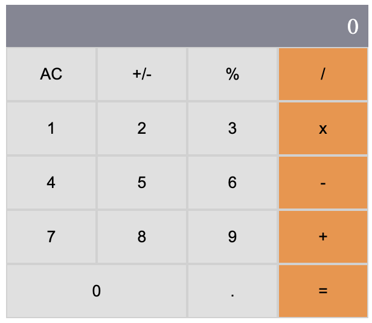

<a name="readme-top"></a>

<div align="center">
  <!-- 
  <br/> -->

  <h3><b>Math Geeks</b></h3>

</div>

# 📗 Table of Contents

- [📖 About the Project](#about-project)
  - [Screenshot](#screenshot)
  - [🛠 Built With](#built-with)
    - [Tech Stack](#tech-stack)
    <!-- - [Key Features](#key-features) -->
  - [🚀 Live Demo](#live-demo)
- [💻 Getting Started](#getting-started)
  - [Setup](#setup)
  - [Prerequisites](#prerequisites)
  - [Install](#install)
  - [Usage](#usage)
  - [Run tests](#run-tests)
- [👥 Authors](#authors)
- [🤝 Contributing](#contributing)
- [⭐️ Show your support](#support)
<!-- - [🔭 Future Features](#future-features)
- [❓ FAQ (OPTIONAL)](#faq) -->
- [🙏 Acknowledgements](#acknowledgements)
- [📝 License](#license)


# 📖 Math Geeks <a name="about-project"></a>

**Math Geeks** is a simple calculator built with <a href="https://reactjs.org/">React.js</a>

## Screenshot <a name="screenshot"></a>
<div align='center'>
  
    <br/>
</div>

## 🛠 Built With <a name="built-with"></a>

### Tech Stack <a name="tech-stack"></a>

<details>
  <summary>Client</summary>
  <ul>
    <li><a href="https://reactjs.org/">React.js</a></li>
  </ul>
</details>

<!-- Features -->
<!-- 
### Key Features <a name="key-features"></a>

> Describe between 1-3 key features of the application.

- **[key_feature_1]**
- **[key_feature_2]**
- **[key_feature_3]** -->

<p align="right">(<a href="#readme-top">back to top</a>)</p>

<!-- LIVE DEMO -->

## 🚀 Live Demo <a name="live-demo"></a>
(not yet deployed)
<!-- - [Live Demo Link](https://yourdeployedapplicationlink.com) -->

<p align="right">(<a href="#readme-top">back to top</a>)</p>

<!-- GETTING STARTED -->

## 💻 Getting Started <a name="getting-started"></a>

To get a local copy up and running, follow these steps.

### Prerequisites

In order to run this project you need:
- Node
- npm

Probably with versions:
- Node >= 19.6.0
- npm >= 9.4.0

### Setup

Clone this repository to your desired folder:

```sh
  cd my-folder
  git clone git@github.com:mohamedSabry0/math-geeks.git
```

### Install

Install this project with:

```sh
  cd math-geeks
  npm i
```


### Usage

To run the project, execute the following command:

#### `npm start`

Runs the app in the development mode.\
Open [http://localhost:3000](http://localhost:3000) to view it in your browser.

The page will reload when you make changes.\
You may also see any lint errors in the console.


### Run tests

To run tests, run the following command:

#### `npm test`

Launches the test runner in the interactive watch mode.\
See the section about [running tests](https://facebook.github.io/create-react-app/docs/running-tests) for more information.

<p align="right">(<a href="#readme-top">back to top</a>)</p>

<!-- AUTHORS -->

## 👥 Authors <a name="authors"></a>

👤 **Mohamed Sabry**

- GitHub: [@mohamedSabry0](https://github.com/mohamedSabry0)
- Twitter: [@mohsmh0](https://twitter.com/mohsmh0)
- LinkedIn: [LinkedIn](https://www.linkedin.com/in/mohamed-sabry0/)

<p align="right">(<a href="#readme-top">back to top</a>)</p>

<!-- 
## 🔭 Future Features <a name="future-features"></a>

> Describe 1 - 3 features you will add to the project.

- [ ] **[new_feature_1]**
- [ ] **[new_feature_2]**
- [ ] **[new_feature_3]**

<p align="right">(<a href="#readme-top">back to top</a>)</p> -->

<!-- CONTRIBUTING -->

## 🤝 Contributing <a name="contributing"></a>

Contributions, issues, and feature requests are welcome!

Feel free to check the [issues page](https://github.com/mohamedSabry0/math-geeks/issues).

<p align="right">(<a href="#readme-top">back to top</a>)</p>

<!-- SUPPORT -->

## ⭐️ Show your support <a name="support"></a>

If you like this project it would be truly appreciated if you give it a ⭐️.

<p align="right">(<a href="#readme-top">back to top</a>)</p>

## 🙏 Acknowledgements <a name="acknowledgements"></a>
> We seek knowledge from the cradle to the grave.

I am grateful for these resources as they were a reason that I obtained a glimpse of their abundance of knowledge:
- [Microverse](https://www.microverse.org/)
- [ReactJS Docs](https://reactjs.org/docs)
- [React Router Docs](https://reactrouter.com/en/main)
- I also thank other resources that might have slipped from my mind to mention, I really appreciate all the efforts in delivering helpful resources of knowledge.  

<p align="right">(<a href="#readme-top">back to top</a>)</p>

<!-- LICENSE -->

## 📝 License <a name="license"></a>

This project is [MIT](./MIT.md) licensed.

<p align="right">(<a href="#readme-top">back to top</a>)</p>
